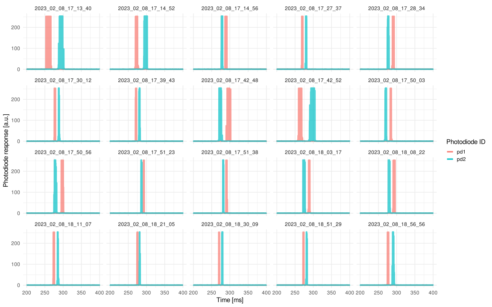
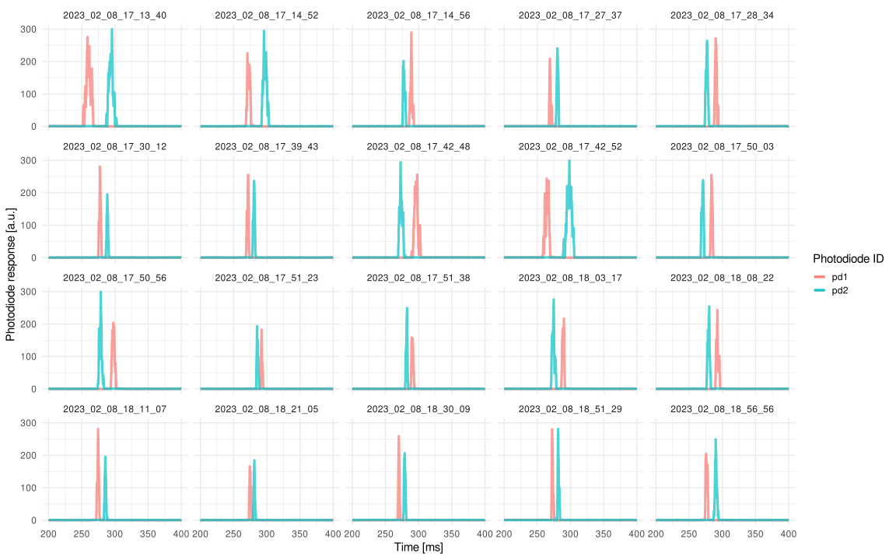

Analysis of LM03 Lightmeter Data
================
Richard Schweitzer
2023-02-13

Do we want to output every figure as a svg instead of png? If so,
determine here:

First, load some necessary packages and the LM03 data, which was
pre-compiled from around 1400 individual trials.

``` r
# packages we'll need
library(data.table)
library(ggplot2)
library(signal)
```

    ## 
    ## Attaching package: 'signal'

    ## The following objects are masked from 'package:stats':
    ## 
    ##     filter, poly

``` r
# LM03 data (compiled previously)
load("LM03_data.rda")
str(lm03_data)
```

    ## Classes 'data.table' and 'data.frame':   5706573 obs. of  10 variables:
    ##  $ trialNum: int  131 131 131 131 131 131 131 131 131 131 ...
    ##  $ staAmp  : int  8 8 8 8 8 8 8 8 8 8 ...
    ##  $ spdFac  : num  1 1 1 1 1 1 1 1 1 1 ...
    ##  $ iniPos  : int  2 2 2 2 2 2 2 2 2 2 ...
    ##  $ movVel  : num  287 287 287 287 287 ...
    ##  $ sacDur  : num  0.0446 0.0446 0.0446 0.0446 0.0446 0.0446 0.0446 0.0446 0.0446 0.0446 ...
    ##  $ time    : num  0.25 0.5 0.75 1 1.25 1.5 1.75 2 2.25 2.5 ...
    ##  $ pd1     : int  0 0 0 0 0 0 0 0 0 0 ...
    ##  $ pd2     : int  1 1 0 1 1 0 1 1 0 1 ...
    ##  $ filename: chr  "2023_02_08_17_03_58" "2023_02_08_17_03_58" "2023_02_08_17_03_58" "2023_02_08_17_03_58" ...
    ##  - attr(*, ".internal.selfref")=<externalptr>

``` r
length(unique(lm03_data$filename)) # number of trials we've recorded
```

    ## [1] 1427

Now check out what the data looks like, use a random subset of data for
that:

``` r
subsample_now <- sample(lm03_data$filename)[1:20] # twenty random trials
# plot raw data:
ggplot(data = lm03_data[is.element(filename, subsample_now)], aes(x = time, y = pd1, color = "pd1")) + 
  geom_line(size = 1.5, alpha = 0.7) + 
  geom_line(data = lm03_data[is.element(filename, subsample_now)], aes(x = time, y = pd2, color = "pd2"), 
            size = 1.5, alpha = 0.7) + 
  theme_minimal(base_size = 15) + 
  facet_wrap(~filename) + 
  labs(x = "Time [ms]", y = "Photodiode response [a.u.]", color = "Photodiode ID")
```

<!-- -->

Looks reasonable, but to reduce the amount of data we could easily
reduce the temporal range a bit.

``` r
# reduce size of data:
lm03_data <- lm03_data[time>=200 & time <=400] 

# plot raw data again:
ggplot(data = lm03_data[is.element(filename, subsample_now)], aes(x = time, y = pd1, color = "pd1")) + 
  geom_line(size = 1.5, alpha = 0.7) + 
  geom_line(data = lm03_data[is.element(filename, subsample_now)], aes(x = time, y = pd2, color = "pd2"), 
            size = 1.5, alpha = 0.7) + 
  theme_minimal(base_size = 15) + 
  facet_wrap(~filename) + 
  labs(x = "Time [ms]", y = "Photodiode response [a.u.]", color = "Photodiode ID")
```

<!-- -->

``` r
# zoom in on single trials:
ggplot(data = lm03_data[is.element(filename, subsample_now[1:2])], aes(x = time, y = pd1, color = "pd1")) + 
  geom_line(size = 0.5, alpha = 0.7) + 
  geom_line(data = lm03_data[is.element(filename, subsample_now[1:2])], aes(x = time, y = pd2, color = "pd2"), 
            size = 0.5, alpha = 0.7) + 
  theme_minimal(base_size = 15) + 
  facet_wrap(~filename) + 
  labs(x = "Time [ms]", y = "Photodiode response [a.u.]", color = "Photodiode ID")+ 
  coord_cartesian(xlim = c(250, 350))
```

<!-- -->

There is quite a bit of noise in there, which we can smooth, right? Its
likely that this is not strictly noise but in fact regular luminance
modulations related to the frequency of the LEDs used in the Propixx
projector instead of a classic color wheel. Still, even at 4000 Hz
sampling rate of the LM03 light meter, this frequency is likely heavily
undersampled. To make it easier for us, we’ll smooth with a
Savitzky-Golay filter…

``` r
# smooth with sgolayfilt
lm03_data[ , pd1s := sgolayfilt(x = pd1, p = 3, n = 9), by = .(filename)]
lm03_data[ , pd2s := sgolayfilt(x = pd2, p = 3, n = 9), by = .(filename)]
# restrict to positive values
lm03_data[pd1s<0, pd1s := 0]
lm03_data[pd2s<0, pd2s := 0]

# compare raw and filtered results in single trial basis
ggplot(data = lm03_data[is.element(filename, subsample_now[1:2])], aes(x = time, y = pd1s, color = "pd1")) + 
  geom_line(data = lm03_data[is.element(filename, subsample_now[1:2])], aes(x = time, y = pd1, color = "pd1"), 
            size = 1, alpha = 0.5) + 
  geom_line(data = lm03_data[is.element(filename, subsample_now[1:2])], aes(x = time, y = pd2, color = "pd2"), 
             size = 1, alpha = 0.5) + 
  geom_line(size = 1.5, alpha = 1) + 
  geom_line(data = lm03_data[is.element(filename, subsample_now[1:2])], aes(x = time, y = pd2s, color = "pd2"), 
            size = 1.5, alpha = 1) + 
  theme_minimal(base_size = 15) + 
  facet_wrap(~filename) + 
  labs(x = "Time [ms]", y = "Photodiode response [a.u.]", color = "Photodiode ID") + 
  coord_cartesian(xlim = c(250, 350))
```

<!-- -->

``` r
# the entire subset, smoothed:
ggplot(data = lm03_data[is.element(filename, subsample_now)], aes(x = time, y = pd1s, color = "pd1")) + 
  geom_line(size = 1.5, alpha = 0.7) + 
  geom_line(data = lm03_data[is.element(filename, subsample_now)], aes(x = time, y = pd2s, color = "pd2"), 
            size = 1.5, alpha = 0.7) + 
  theme_minimal(base_size = 15) + 
  facet_wrap(~filename) + 
  labs(x = "Time [ms]", y = "Photodiode response [a.u.]", color = "Photodiode ID")
```

<!-- -->

Okay, now we’ll try to extract the center of gravity of these peaks.
Since the data is still noisy, a simple max operation wouldn’t be a
great solution, so let’s try a average weighted by luminance
measurements. To make sure we exclude the irrelevant data points, we’ll
threshold first. Let’s aggregate:

``` r
cutoff <- 10 # ignore all data points below this value
# aggregate for each photo sensor, then merge
lm03_agg_pd1 <- lm03_data[pd1s > cutoff, .(center_pd1 = weighted.mean(x = time, w = pd1s)), 
                          by = .(filename, staAmp, spdFac, iniPos, movVel, sacDur)]
lm03_agg_pd2 <- lm03_data[pd2s > cutoff, .(center_pd2 = weighted.mean(x = time, w = pd2s)), 
                          by = .(filename, staAmp, spdFac, iniPos, movVel, sacDur)]
lm03_agg <- merge.data.table(x = lm03_agg_pd1, y = lm03_agg_pd2)
rm(lm03_agg_pd1, lm03_agg_pd2) # not needed anymore
# this is the absolute time passed between the two estimated peaks
lm03_agg[ , time_between := abs(center_pd1 - center_pd2)] 
lm03_agg[ , direction := ordered(iniPos)]
head(lm03_agg)
```

    ##               filename staAmp spdFac iniPos movVel sacDur center_pd1 center_pd2
    ## 1: 2023_02_08_17_03_58      8   1.00      2 286.54 0.0446   280.7152   287.8415
    ## 2: 2023_02_08_17_04_06      8   0.50      2 286.54 0.0446   278.4568   292.9363
    ## 3: 2023_02_08_17_04_12      4   1.00      2 178.78 0.0338   271.9873   282.6208
    ## 4: 2023_02_08_17_08_31     12   0.50      2 351.48 0.0554   277.1933   289.4147
    ## 5: 2023_02_08_17_08_40     12   1.25      2 351.48 0.0554   283.8467   289.2388
    ## 6: 2023_02_08_17_13_17      4   0.50      1 178.78 0.0338   298.0533   276.6440
    ##    time_between direction
    ## 1:     7.126315         2
    ## 2:    14.479544         2
    ## 3:    10.633491         2
    ## 4:    12.221416         2
    ## 5:     5.392131         2
    ## 6:    21.409275         1

``` r
# plot histogram real quick:
ggplot(lm03_agg, aes(x = time_between, color = direction, fill = direction)) + 
  geom_histogram(binwidth = 1, position = "stack") +
  facet_grid(staAmp~spdFac) + 
  theme_minimal(base_size = 15) + 
  scale_color_viridis_d(end = 0.7) + scale_fill_viridis_d(end = 0.7) + 
  labs(x = "Time between photodiode responses [ms]", y = "Number of trials", 
       color = "Motion direction", fill = "Motion direction") 
```

<!-- -->

This looks very clean. Now we can make a final aggregate and plot.
Importantly, the two sensors were approximately 2 degrees of visual
angle apart from each other. Since the velocity was constant, we can
also evaluate whether the measured durations are compatible with the
specified velocities.

``` r
# first, make the population aggregate
lm03_superagg <- lm03_agg[ , .(time_between = mean(time_between), 
                               time_between_sd = sd(time_between), 
                               N = length(time_between)), 
                           by = .(staAmp, spdFac, movVel, sacDur, direction)]
lm03_superagg[ , time_between_se := time_between_sd / sqrt(N)]
# compute the expected duration given the distance between the two sensors
lm03_superagg[ , movVelAbs := spdFac * movVel]
lm03_superagg[ , assumedDist := 2]
lm03_superagg[ , assumed_time_between := assumedDist / movVelAbs * 1000]

# order:
lm03_superagg <- lm03_superagg[order(staAmp, spdFac, direction)]
head(lm03_superagg)
```

    ##    staAmp  spdFac movVel sacDur direction time_between time_between_sd  N
    ## 1:      4 0.25000 178.78 0.0338         1     43.55186       0.5281953 22
    ## 2:      4 0.25000 178.78 0.0338         2     43.77828       0.4746665 22
    ## 3:      4 0.33333 178.78 0.0338         1     33.27817       0.6145639 22
    ## 4:      4 0.33333 178.78 0.0338         2     33.47141       0.3702110 24
    ## 5:      4 0.50000 178.78 0.0338         1     22.01987       0.4867376 23
    ## 6:      4 0.50000 178.78 0.0338         2     21.96496       0.5326187 22
    ##    time_between_se movVelAbs assumedDist assumed_time_between
    ## 1:      0.11261162  44.69500           2             44.74773
    ## 2:      0.10119923  44.69500           2             44.74773
    ## 3:      0.13102546  59.59274           2             33.56114
    ## 4:      0.07556901  59.59274           2             33.56114
    ## 5:      0.10149181  89.39000           2             22.37387
    ## 6:      0.11355469  89.39000           2             22.37387

``` r
# save, so that this data can be plotted by someone else
write.csv(x = lm03_superagg, file = "LM03_results.csv", row.names = FALSE)

# final plot, dotted line indicates theoretically assumed duration
ggplot(data = lm03_superagg, aes(x = spdFac, y = time_between, color = direction)) + 
  geom_ribbon(data = lm03_superagg, aes(x = spdFac, y = time_between, fill = direction, 
                                          ymax = time_between + 2*time_between_sd, 
                                          ymin = time_between - 2*time_between_sd), 
                size = 1.5, alpha = 0.3, 
              color = NA) + 
  geom_line(alpha = 0.7, size = 1.5) + 
  geom_line(data = lm03_superagg, aes(x = spdFac, y = assumed_time_between, color = direction), 
            linetype = "dotted", size = 1.5, color = "black") + 
  facet_wrap(~staAmp, nrow = 1) + 
  theme_minimal(base_size = 15) + 
  scale_color_viridis_d(end = 0.7) + scale_fill_viridis_d(end = 0.7) + 
  labs(x = "Velocity [prop. of peak velocity]", y = "Time between photodiode responses [ms]", 
       color = "Motion direction", fill = "Motion direction")
```

<!-- -->

Finally, this shows that leftward and rightward motion take the same
time when presented on the Propixx DLP projector at 1440 Hz. In
addition, measured linear motion speed – as indicated by the measured
time between the activations of two horizontally aligned photo diodes –
is exactly as specified in the stimulus.
